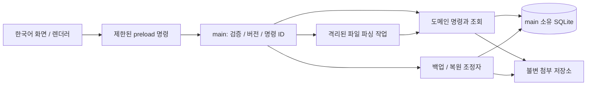

# 학교 정보자산 관리 프로그램 설계 검토안

문서일: 2026-10-05 · 상태: **승인된 제품 명세 · 구현 진행 중**

## 1. 핵심 요약

정보부 관리자 1명이 학교 장비와 IP 대장을 한곳에서 관리하는 한국어 로컬 Electron 프로그램이다. 개별 장비의 사용자·장소·네트워크 관계와 변경 이력을 보존하고, 엑셀 이관부터 배정·반납·대여·수리·실사·폐기, 인계 자료 출력과 새 PC 복원까지 이어지는 완전한 업무 흐름을 제공한다.

권장 구조는 **Windows 11 x64의 오프라인 단일 관리자 앱, Electron main이 소유하는 SQLite, 별도 불변 첨부 저장소**다. IP는 관리자의 입력·엑셀·명시적 확인으로 관리한다. 자동 LAN 탐지는 포함하지 않으며, 장비가 꺼져 있거나 교사가 퇴직했다는 이유만으로 기존 IP를 비우지 않는다.

질문에 대한 판단을 맡겨 주신 데 따라 Windows 우선 지원, IPv4와 비중첩망, 파일·데이터 규모 및 성능 목표를 제안했다. 이 선택은 실제 학교 환경을 확인한 사실이 아니므로 아래 지원 조건과 함께 검토할 가정이다. 모든 데이터·첨부·로그는 로컬에 두고 학생정보·비밀번호·방문 기록은 수집하지 않는다.

이 문서는 제품 설계안이다. 제품 코드·설치 파일·Windows 실행 시험·성능 측정은 아직 완료되지 않았으며, 45개 수용 기준과 통합 업무 검증을 완료 조건으로 정한다.

## 2. 의도와 첫 완성 버전

목표는 흩어진 엑셀을 대체하면서 “이 장비를 누가 어디서 사용하며, 어떤 IP가 왜 점유되어 있고, 언제 무엇이 바뀌었는가”를 한 곳에서 확인하는 것이다. 공식 재산대장·회계시스템을 대체하지 않으며 공식 물품번호는 그대로 보존한다. 개별 장비 기록에서 수량을 계산하고 실물 확인 결과와 대장 수량을 섞지 않는다.

첫 완성 버전은 빈 앱에 합성 엑셀을 넣은 뒤 배정·반납·이동·대여·수리·퇴역·폐기, PC 교체와 IP 해제, 실사, 인계 자료 출력, 새 PC 복원까지 이어지는 완전한 업무 흐름을 제공해야 한다. 단순 CRUD 화면만으로 완료하지 않는다.

### 포함

- 노트북·데스크톱·모니터의 개별 등록, 검색, 일괄 선택, 상세 이력과 첨부.
- 교직원/담당자, 계층형 장소, 장비 담당 관계, 임시 대여, 수리 및 폐기 절차.
- 여러 인터페이스와 IP, 여러 비중첩 망, 배정과 수동/파일 관측의 분리.
- 실사 세션, 시작 시점의 고정 대상, 불일치·미발견·미확인과 후속 정리.
- 열 매핑과 검토를 거치는 `.xlsx` 이관, 안정키 기반 재가져오기, 업무별 엑셀 내보내기.
- 원자적 상태 변경, 감사 이력과 정정, 일관 백업, 검증·복구 가능한 복원.
- 한국어 UI, 키보드 조작, 진행·오류·미완료 상태, 인계용 사용 설명과 합성 예제.

### 제외 / 후속 버전

LAN 스캔·자동 탐지·백그라운드 수집·교사 PC 에이전트·네트워크 설정 변경, 웹서버·교사 포털·여러 사용자 로그인·공유 DB·클라우드 동기화, QR/바코드·교사 제출 전용 양식, IPv6, 주소가 겹치는 독립 VLAN/VRF, 다중 학교 데이터셋 동시 개방, 자동 업데이트·원격 분석을 제외한다. 학생정보·비밀번호·검색/방문 기록은 저장하지 않는다. 첫 버전은 `.xls`, `.xlsm`, 매크로 실행, 임의 스크립트 및 수식 평가를 지원하지 않는다.

실사 기능은 첫 완성 버전에 포함한다. 제외 항목 때문에 필수 업무를 축소하거나 테스트용 장난감 앱으로 대체할 수 없다.

## 3. 대안 비교와 권고

| 대안 | 장점 | 비용·위험 | 판정 |
|---|---|---|---|
| A. Electron main 소유 SQLite + 불변 첨부 파일 + 일관 백업 번들 | 도메인과 쓰기 경계가 하나이고 첨부 용량을 DB와 분리 | DB·첨부·설정의 동일 시점 보존을 설계해야 함 | **권고**: 단일 관리자, 첨부 10GB 검증 가정에 적합 |
| B. main 소유 SQLite에 첨부 BLOB까지 저장 | 데이터와 첨부의 트랜잭션·스냅샷 경계가 단순 | 큰 DB의 I/O·백업 시간과 복사 공간 부담 | 첨부가 매우 작은 환경의 실현 가능한 대안 |
| C. main이 감독하는 전용 로컬 데이터 프로세스 + SQLite | 긴 데이터 작업과 UI 수명 분리에 유리 | 프로세스 간 명령·종료·장애 복구 경계가 증가 | 첫 버전 규모에서 A가 목표를 못 맞출 때 재검토 |

SQLite 기반 A안을 권장 설계로 제안한다. 제품 의존성·버전·성능을 이미 검증한 결과는 아니다. Electron/SQLite의 버전별 API·패키지 호환성, 의존성 버전과 배포 형식은 기술 검증 대상으로 남으며, 도메인 의미는 그 선택에 따라 약화할 수 없다.

## 4. 실행 환경·규모·한계

첫 배포 대상 가정은 **Windows 11 x64, 관리자 권한 없는 일반 OS 계정**, 한 PC의 로컬 디스크다. 설치 이후 일반 업무와 도움말은 인터넷 없이 작동한다. Linux는 개발·합성 검증 환경이며 Linux 성공이 Windows 설치·실행 증거를 대신하지 않는다. 실제 Windows 실행 환경 확보와 증거가 없으면 “Windows 릴리스 검증 완료”를 선언하지 않는다.

| 검증 항목 | 첫 릴리스의 합성 검증 기준 |
|---|---|
| 데이터 | 자산 10,000, 사람 2,000, 장소 300, 인터페이스 30,000, 실제망 64, 주소 레코드 100,000, 관측 100,000, 감사 이벤트 500,000 |
| 실사 | 동시 진행 1세션, 한 세션 기준 자산 최대 10,000; 이전 완료 세션 보존 |
| 파일 | 첨부 누적 10GB, 파일당 25MB; import `.xlsx` 25MB 이하·총 데이터행 50,000 이하·해제 크기 250MB 이하·시트 20 이하·전체 비어 있지 않은 셀 1,000,000 이하·시트당 매핑 열 100 이하 |
| 백업 | 번들 15GB 이하·총 해제 크기 15GB 이하·개별 항목 수 100,000 이하; DB/설정도 한도 계산에 포함 |
| 기준 PC | SSD, RAM 8GB, 논리 CPU 4개; 실제 검증 보고서에 CPU·OS·앱 빌드·데이터 크기 기록 |
| 응답 목표 | 위 데이터에서 로컬 검색/목록 첫 페이지 p95 ≤ 1초, 일반 단건 쓰기 p95 ≤ 500ms, 준비 상태까지 시작 ≤ 5초 |
| 긴 작업 | 진행 단계·취소 가능 여부 표시; 임포트 검토 50,000행 ≤ 60초, 적용 ≤ 120초; 10GB 백업/복원 각 ≤ 15분 목표 |

성능은 설계 목표이며 측정값이 아니다. 후속 검증은 같은 기준 PC에서 준비 후 검색/쓰기 각각 30회, 시작 5회, import 및 백업/복원 각 3회 측정한다. 외부 백업 매체의 쓰기 속도는 따로 기록한다. 초과 규모를 발견하면 조용히 절단하지 않고 한도와 처리 방법을 안내한다. 입력 제한은 데이터 훼손 방어선이며 이후 성능 개선으로 확대할 수 있다.

IPv4 전체 주소와 prefix 0–32를 취급한다. prefix ≤ 30에서는 네트워크/브로드캐스트 주소를 사용자 배정에서 제외하고, /31은 두 주소, /32는 단일 주소를 제품의 호스트 후보로 취급한다. 게이트웨이 지정은 선택이며 지정 주소는 해당 망 안에 있어야 하고 일반 배정에서 제외한다. 이 정책을 합성 테스트로 고정한다. 큰 CIDR의 모든 주소를 미리 만들거나 열거하지 않고 범위 연산과 페이지 조회를 사용한다.

## 5. 아키텍처와 모듈 경계

| 모듈 | 책임과 계약 |
|---|---|
| 화면 | 입력 초안·조회·명령 결과 표시. 원시 SQL·임의 파일 경로·셸 실행 권한 없음 |
| preload/IPC | 작업별 명명된 최소 명령, 입력 스키마·크기·호출 출처 검증. 원시 IPC/전체 Node API를 렌더러에 노출하지 않음 |
| 도메인 서비스 | 모든 자산·IP·실사 전이와 권한/관계 검증. 수동 UI와 import가 같은 규칙 사용 |
| 저장 서비스 | 하나의 쓰기 대기열, DB 트랜잭션, 외래키, 유일키, 기대 버전, 이벤트·명령 결과 저장 |
| 파일 이관 | 허용 형식 파싱, 정규화·매핑·계획·충돌 표시. 미리보기 단계에서는 DB를 변경하지 않음 |
| 내보내기 | 읽기 스냅샷에서 보고서 생성, 민감 필드 선택, 안전한 Excel 셀 출력 |
| 실사 | 기준 집합·관측 결과·현재 변경 비교·종료 보고; 장부 수정은 별도 도메인 명령 |
| 백업/복원 | 유지보수 잠금, 일관 스냅샷, 해시 검증, 비활성 데이터 세대 검증·전환·복구 |
| 감사/미해결 | 이력 조회·정정 연결, 미반납/미확인/충돌 의심/해제 대기 등을 원인 레코드로 연결 |

제품은 로컬 신뢰 자산만 렌더링하고 Node 통합 비활성화·context isolation·렌더러 sandbox·제한적 CSP를 설계 요구로 둔다. 웹 탐색·새 창·자동 다운로드를 차단한다. 사용자 파일명/엑셀 셀은 HTML로 실행하지 않는다. IPC 요청은 출처·종류·필드·길이를 검증하고 오류에 SQL/개인 경로/스택을 노출하지 않는다. 구체 Electron 설정과 API의 현행 호환성은 후속 검증 대상이다.

파일 파싱·해시 같은 긴 계산은 UI를 막지 않는 작업 경계로 분리하지만, DB 소유권과 최종 전이 권한은 main에 남긴다. 앱의 두 번째 인스턴스는 기존 창을 활성화하고 동일 데이터 폴더를 쓰지 않는다. 네트워크 공유/동기화 폴더를 DB 위치로 지원하지 않으며 데이터 디렉터리는 앱 관리 로컬 위치로 제한한다. 백업 파일은 명시적으로 선택한 외부 매체에 복사할 수 있다.

## 6. 엔터티와 관계

모든 내부 키는 생성 후 바뀌지 않는 ID다. 공식 물품번호·제조번호는 문자열 속성으로 원형과 앞자리 0을 보존하며 내부 키를 대신하지 않는다. 수정 가능한 집계에는 `version`, 데이터셋에는 `dataset_id`, `revision`, 스키마 버전이 있다. 활성 세대의 `generation_epoch`는 복원/롤백마다 새로 발급하는 값으로, 백업 안의 과거 값으로 되돌리지 않는다.

| 엔터티 | 핵심 필드·카디널리티 |
|---|---|
| Person | 이름/업무용 표시명, 부서·직책 선택, active/inactive. 학생 엔터티 없음 |
| Location | 이름, 상위 장소 0..1; 순환 불가. 자산 위치 1개. `미지정`도 명시 장소이며 미해결로 표시 |
| Asset | internal ID, 종류, 제조사/모델, serial, 공식 번호, 소유구분, 취득일/출처, 보증 만료, lifecycle, 별도 loss_status(none/confirmed), 위치, version |
| Assignment | Person 1 : N Asset 이력. 자산당 열린 기본 배정 0..1, 역할은 사용자 또는 관리책임자. 종료 이력 보존 |
| Loan | 자산당 열린 대여 0..1, borrower, 출발 위치, 대여/기한/반납일. 기본 배정을 유지하며 현재 임시 점유자를 별도 표시 |
| Repair | 자산당 열린 수리 0..1, 증상, 접수/완료, 업체명 선택, 결과·비용 선택. 대여 반납 후 접수 |
| Interface | Asset 1 : 0..N. 종류·표시명·MAC 선택·enabled/disabled. 모니터 0개 정상. MAC 중복은 검토 신호이며 안정키 아님 |
| RealNetwork / Alias / Subnet | 실제망의 안정 ID, 별칭 0..N, IPv4 CIDR 1..N, gateway/DNS·static/DHCP/exclusion 범위. 별칭은 기존 ID를 참조 |
| AddressSlot | `(real_network_id, 정규화한 전체 IPv4)` 유일. 상태, 원상태, 대상 interface 선택, version. 인터페이스 1 : 0..N 현재 주소 |
| AllocationEvent / Evidence | 슬롯 변경 이력, 해제 요청/확인/최종 승인, 연결 해제 근거 및 actor. 기존 연결을 삭제하지 않고 기간 종료로 표현 |
| ObservationSession / Observation | 관측 회차 ID·확인 대상 시간 구간, 망/IP, 관측 MAC/자산 후보 선택, observed_at/recorded_at, 출처·원문, supersedes 선택. 중복 관측 허용. 회차 ID와 파일 import 실행 ID는 구별 |
| InventorySession / Item / Result | 세션 1 : N 고정 기준 자산. 당시 담당·장소·버전 보존; 결과와 현재 장부 비교를 별도 저장 |
| ImportBatch / Mapping | source namespace, 행 안정키, 정규화 해시, 처리 결과·원본 파일 해시·도메인 명령 ID |
| AuditEvent / CommandReceipt | actor·UTC 기록시각·사건 종류·before/after·이유·correlation·corrects. 성공 명령 ID는 데이터셋 내 유일 |
| Attachment | 원본 표시명, 허용 MIME/확장자, 길이·해시·앱 내부 blob ID, 관계 대상. 불변 바이트와 참조 이력 |
| BackupManifest / MaintenanceJournal | 형식·앱·스키마·dataset ID·revision·각 파일 길이/해시, 복원 전후 세대·단계·복구 상태 |

배정의 담당자, 대여의 임시 점유자, 위치, 운영 상태, 물리 확인 상태는 독립이다. 대여 중에는 기본 담당과 임시 점유자를 둘 다 표시한다. 장기 배정 변경은 열린 대여를 먼저 반납해야 가능하다. 대여 반납은 임시 점유를 종료하고 기존 기본 배정을 유지하며 반납 위치를 명시한다. 일반 반납은 기본 배정을 종료하고 새 보관 위치를 선택한다. 어느 반납도 IP를 자동 해제하지 않는다.

사람/장소/인터페이스/망은 이력에서 참조되면 삭제 대신 비활성화한다. 사람의 퇴직은 기존 배정·대여·IP를 유지하되 신규 배정/대여 대상에서는 제외한다. 인터페이스는 점유 주소가 있으면 비활성화할 수 없다. 별도의 로컬 운영자 표시명은 감사 actor이며 애플리케이션 로그인 계정이나 교직원 인사정보가 아니다.

현재 자산이 있는 장소는 먼저 자산을 이동해야 비활성화할 수 있고, 점유 주소가 있는 망은 먼저 점유를 해소해야 비활성화할 수 있다. 과거 사건에서의 이름/참조는 그대로 보존하며 별칭·표시명 변경으로 내부 ID를 바꾸지 않는다.

## 7. 공통 불변식과 자산 전이

1. 변경된 현재 상태, 이력, 명령 처리 결과는 같은 트랜잭션에서 확정한다. 이력 기록 실패는 업무 실패다.
2. 모든 쓰기 명령은 `dataset_id`, `generation_epoch`, `command_id`, 요청 내용 해시를 가진다. 활성 세대 안에서 같은 ID/같은 내용의 재전송은 기존 결과를 반환한다. 같은 ID/다른 내용은 오류다. 기대 버전이 틀리면 이전 폼을 덮어쓰지 않는다. 복원/롤백 전 epoch의 명령·미리보기·확인·파일 접근 토큰은 revision이 우연히 같아도 거절한다. 구세대 명령 결과는 이력 조회만 가능하고 변경 명령 재시도로 적용하지 않는다.
3. 조회용 데이터셋 revision은 성공한 변경마다 증가한다. 한 작업이 수백 자산을 바꾸어도 각 자산의 ID·수량·전후 이력이 남고 전체 성공 또는 전체 취소된다.
4. 물리적으로 확인하지 못한 자산은 자동 분실·폐기하지 않는다. 분실 확정은 별도 관리자 선언/해소 사건이며 IP 점유는 유지한다. 확인된 분실 상태에서 신규 배정·대여는 막는다.
5. 장부 수량은 행 합계다. 구입 수량을 하나의 장비 행에 넣지 않으며 묶음 등록은 N개의 개별 ID를 생성한다. `미폐기 대장 수량`은 퇴역·분실을 포함한 미폐기 자산, `전체 등록 수량`은 폐기 포함으로 구분하고 사용 가능 수량과 혼동하지 않는다.
6. 기존 기록의 오탈자는 `corrects_event_id`와 사유가 있는 새 사건으로 정정한다. 과거 사건 수정이 이후 정상 사건을 취소하지 않는다. 현재 상태를 바꾸려면 현재 버전에서 별도 보정 명령을 검증한다.

| 업무 | 허용·변경 | 차단·IP 영향 |
|---|---|---|
| 등록/배정 | ready 자산, active 사람, 명시 장소. 재배정은 이전 기간 종료와 새 기간 시작 | 수리·퇴역·폐기·확정 분실·열린 대여에서는 신규 배정 차단; 사람 변경으로 IP 변경 없음 |
| 반납/이동 | 열린 대여가 없는 자산의 기본 담당 종료 또는 위치 변경을 각각 명시. 일괄 이동은 개별 대상과 버전 검토 | 장소와 실제망의 대응을 추정하지 않음. 점유 IP가 있는 자산의 위치가 바뀌면 IP 유지·`망 확인 필요` 과제 생성; 담당자만 바뀌면 새 과제 없음 |
| 대여/반납 | ready → 열린 대여; 기한·대상·위치 필수. 반납은 해당 대여 종료 | 중복 대여·수리·퇴역·폐기 차단. 연체는 조회 상태로 계산, 자동 반납 없음 |
| 수리 | ready → in_repair → ready. 완료 시 결과 기록 | 열린 대여는 먼저 반납. 기존 배정/IP 유지; 폐기 필요 시 수리 결과를 기록하고 별도 절차 |
| 퇴역 | ready → retired; 신규 업무 중단·정리 과제 표시 | 열린 대여/수리를 먼저 종료. 기존 배정·IP가 남아 있을 수 있음 |
| 퇴역 취소 | retired → ready, 사유와 현재 버전 필요 | 폐기 완료 자산에는 일반 취소 제공 안 함 |
| 분실 확정/회수 | 별도 loss_status none → confirmed는 사유·근거; 회수 확인 confirmed → none은 긍정적 실물 확인과 현재 버전 필요 | lifecycle·담당·IP 자동 변경 없음. 폐기 자산의 오기는 먼저 폐기 정정 절차 적용 |
| 폐기 | retired → disposed; 일자·사유·근거, 마지막 확인 | 열린 배정/대여/수리, reserved/active/pending_release IP, 미처리 관계가 있으면 차단 |
| 폐기 오기 정정 | 지정 정정 명령으로 disposed → retired, 원사건 연결·사유 | 과거 사용자/IP를 자동 복원하지 않음; ready 복귀 및 재배정은 후속 명시 명령 |

실제 반납 없는 분실 장비를 정리해야 하면 관리자가 분실 확정과 대여/배정의 `분실로 종료` 이유를 각각 기록한다. 네트워크 해제 확인은 별도이며 물건을 못 찾았다는 사실만으로 생략하지 않는다. 조건을 충족하지 못한 폐기는 퇴역·정리 대기로 남는다.

`망 확인 필요` 과제의 해소는 관리자 확인 결과·사유를 사건으로 기록한다. 과제 해소 자체가 IP를 바꾸지는 않는다. 대여·반납으로 위치가 바뀌는 경우에도 같은 생성 규칙을 적용한다.

## 8. 실제망, IP 배정과 관측

### 망과 적격성

CIDR 이름이나 마지막 옥텟이 키가 아니다. 동일 실제망의 모든 별칭은 같은 ID를 참조한다. **첫 버전은 서로 다른 실제망 ID 간 중첩 CIDR을 거부한다.** 같은 망 안에서도 겹치는 subnet 등록은 거부한다. 동일 CIDR 입력 시 자동 병합하지 않고 기존 망의 별칭으로 연결하는 명시 선택 또는 취소를 제공한다. 독립 VLAN이 같은 주소를 쓰는 환경은 미지원 가정으로 알린다.

gateway, DNS, static/DHCP 범위, 명시 제외 범위를 설정한다. DNS는 외부 주소일 수도 있어 망 내부 조건을 강제하지 않지만 형식은 검증한다. static과 DHCP 범위는 중첩 불가다. 주소 배정은 static 관리 범위의 적격 호스트에만 가능하다. 미설정 subnet에는 정책상 호스트 범위를 static 기본값으로 제시하되 저장 전 검토한다. DHCP 범위는 수동 고정 배정에서 제외하며 DHCP 서버 제어/동적 lease 관리는 하지 않는다. 외부 DHCP 관측은 증거로만 저장할 수 있다.

슬롯이 없는 주소도 적격성과 정책 제외를 먼저 계산한다. 범위 전체를 슬롯 행으로 만들 필요는 없다. 슬롯이 있는 경우 SQL 유일키 `(real_network_id, full_ip)`와 상태/바인딩 제약으로 점유를 보호한다. reserved/active/pending_release에는 존재하는 enabled 인터페이스 1개가 필수이며 unassigned/excluded에는 바인딩이 없다. 정책상 제외 범위는 슬롯 존재와 무관하게 배정을 막는다. 변경된 범위가 점유 주소를 배제하거나 범위 밖으로 내보내면 설정 변경을 거부한다.

신규 예약·예약 활성화·이전의 수신 대상은 enabled 인터페이스이고 소속 자산이 ready이며 확정 분실이 아니어야 한다. 열린 대여 자체는 IP 수신 적격성을 막지 않는다. 이미 점유한 IP는 이후 수리·퇴역·분실에도 유지하되 그 상태에서 신규 예약·활성화·이전 수신은 금지한다. 이때 기존 점유의 해제 또는 다른 적격 자산으로의 이전은 허용한다. 슬롯 바인딩의 지속 조건은 존재하는 enabled 인터페이스이며, 신규 수신 적격성과 구별한다. 폐기 전에는 모든 점유를 해소해야 한다.

### 상태 전이

| 전이 | 필수 조건 / 원자적 결과 |
|---|---|
| unassigned → reserved | 적격 주소·인터페이스, 관리자 의도 기록. 예약도 점유하며 자동 만료하지 않음 |
| reserved → active | 같은 바인딩, 관리자 사용 개시 확인. 실제 LAN 설정은 앱 밖에서 수행 |
| active/reserved → pending_release | 요청 이유, 원상태·바인딩 유지. 즉시 재배정 불가 |
| pending_release → 원상태 | 명시 취소. 원바인딩 유지, 요청/취소 이력 보존 |
| pending_release → unassigned | 기존 장비가 해당 IP로 재접속하지 않도록 처리한 근거·시각·actor 기록 후 별도 최종 확인. 바인딩 기간 종료 |
| unassigned ↔ excluded | 제외/해제 사유와 정책 적격성 검토. 점유 주소를 excluded로 덮어쓰지 않음 |
| active 또는 reserved의 PC 이전 | 같은 슬롯 안에서 old → new interface 교체. 양측/슬롯 버전, 새 장비 적격성, 기존 연결 해제 확인·최종 확인 필요. 결과는 원래 active/reserved 상태 유지 |

reserved 취소도 두 단계 해제 절차를 따른다. 아직 적용하지 않은 예약이었다면 `기존 장비에 설정한 적 없음 확인`을 근거로 기록한다. IP 이전은 요청·근거 입력 단계에서 기존 바인딩을 유지하며 최종 확정 때 한 트랜잭션으로 이전한다. pending_release에서는 직접 이전하지 않고 해제를 끝내거나 요청을 취소한 후 이전한다. old 장비를 삭제하거나 teacher_id만 변경해서 이전을 흉내 낼 수 없다.

초기 Excel에서 active 주소를 등록하는 경우에도 관리자 검토와 예약·활성화의 적격 조건을 모두 검사하고 해당 사건들을 한 번의 이관 트랜잭션으로 남긴다. 기존 점유의 이전·해제를 일반 업데이트로 대체하지 않는다.

관측 결과는 `unknown / matching / mismatching / suspected_conflict`다. 비교 범위는 명시 선택한 하나의 관측 회차/시간 구간과 배정 revision이다. 관측 회차는 import 실행 ID와 구별해 보존한다. 먼저 같은 회차·IP에서 서로 다른 식별자의 증거가 함께 있으면 배정 존재와 무관하게 suspected_conflict로 표시한다. 그 외 식별 근거 또는 권위 배정이 없어 비교할 수 없으면 unknown, 하나의 식별자가 배정 인터페이스와 일치하면 matching, 하나의 식별자가 다른 장비를 가리키면 mismatching이다. 한 MAC/자산으로 정규화되는 여러 표현은 다른 장비로 세지 않는다.

서로 다른 과거 회차의 구형/신형 PC 식별자 차이만으로 충돌 의심을 만들지 않는다. 같은 관측의 단순 중복도 충돌 근거가 아니다. 원관측은 불변이며 조회 시 회차·관측 시각·출처·비교 revision을 보여준다. 시간 구간이 넓거나 오래된 증거의 의심은 실제 동시 충돌의 확정이 아니다. 정정은 `supersedes`로 연결하고 배정 변경은 별도 명령이다.

**수동 확인은 실제 LAN 무충돌을 보증하지 않는다.** 퇴직, 전원 꺼짐, 응답 없음, 물리 미발견은 해제 증거가 아니다. 관리자가 연결 해제를 확인할 수 없으면 기존 IP를 점유한 채 다른 적격 주소를 선택한다. 화면의 `장부상 미배정`을 `실제 망에서 안전한 주소`로 표시하지 않는다.

## 9. 실사와 수량 계약

한 번에 하나의 실사를 열고 대상 종류/장소 등을 확정할 때 자산 ID와 당시 담당·장소·버전을 고정한다. 결과는 `미확인 / 일치 / 불일치 / 미발견` 중 하나이며 결과 수정도 이전 기록을 보존한다. 일치/불일치는 실물 관측을 수반하고, 미발견은 찾아보았으나 찾지 못한 명시 기록이다. 미확인은 작업 미수행 상태다.

일치/불일치는 실사 시작 스냅샷의 담당·장소와 실제 확인 내용을 비교한다. 현재 대장과의 일치 여부는 별도로 표시한다. 결과에는 확인한 자산 ID·실제 확인 시각·기록 시각·actor를 남긴다. 최근 실물 확인은 정정되지 않은 유효한 긍정적 실물 확인의 가장 최근 확인 시각이다. IP 관측·대장 수정·미발견은 그 날짜를 갱신하지 않는다. 일상 업무에서도 자산 상세의 명시적 실물 확인 명령으로 근거를 남길 수 있다.

고정 대상 N은 네 결과 수의 합과 항상 같다. 실물 확인 수는 일치+불일치이며 미발견·미확인과 분리한다. 실사 후 새 등록, 이동, 퇴역·폐기는 `기준 이후 변경` 표시로 나란히 제공한다. 기준 외 발견 자산은 별도 목록으로 남기고 분모에 자동 추가하지 않는다. 실사 결과가 장부의 담당·장소·상태를 덮어쓰지 않는다.

실사 종료는 미해결 항목이 있어도 그 건수와 이유를 명시 확인하면 가능하다. 종료 결과는 불변이며 이후 설명 보완은 추가 기록, 재조사는 새 세션이다. 불일치 해결은 현재 버전의 이동/정정 명령을 별도로 실행하고 실사 결과와 연결한다. 대장 최신 수량과 과거 실사 보고서는 각 기준 시각을 표시한다.

## 10. 엑셀 이관과 출력 계약

### 가져오기

흐름은 `파일 선택 → 시트/열 매핑 → 정규화/검증 → 관계·중복·충돌 검토 → 적용 대상 확정 → 원자적 적용 → 결과/안정키 문서 출력`이다. 미리보기 취소·뒤로 이동은 DB 변경 0건이다. 재매핑하면 이전 검토 승인은 무효가 된다.

자산/사람/장소/망/인터페이스/배정/관측 시트를 지원하며 원본이 평면 표면 매핑을 통해 초안 엔터티를 만든다. 새 사람·장소·망 생성도 검토 대상으로 보여주고 이름만 같다고 조용히 합치지 않는다. 내부 ID, 외부 source namespace+row key, 정규화 내용 해시를 구분한다.

- 동일 안정키·이전에 적용한 원본과 동일한 정규화 내용의 재가져오기는 no-op이며 감사 업무 이벤트를 중복 생성하지 않는다. 그 사이 현재 DB를 수동 변경했더라도 과거 원본 재실행으로 되돌리지 않는다. 현재 값과 원본 값의 차이는 보고하고, 그 값을 의도적으로 다시 적용하려면 새로운 변경 검토/명령으로 확정한다. 가져오기 실행 기록에는 no-op 건수를 남긴다.
- 정규화 문서에는 `dataset_id`를 포함한다. 다른 데이터셋의 내부 ID는 현재 자산을 식별하는 키로 신뢰하지 않는다. 다른 장부 문서는 외부 자료로 명시 전환해 새 ID/외부 source namespace로 검토하며 자동 합치지 않는다. 복원과 이관의 기능을 혼동하지 않는다.
- 같은 안정키의 변경 행은 diff와 기대 버전으로 검토한다. 공식 물품번호/serial은 매칭 후보이며 유일성이 입증되지 않으면 자동 병합하지 않는다. 내부 ID와 외부 키가 서로 다른 자산을 가리키면 충돌이다.
- 안정키 없는 기존 파일의 수정본을 항상 자동 매칭할 수 있다고 보장하지 않는다. 첫 이관 후 내부 ID가 담긴 정규화본을 제공한다. 같은 원본의 정확한 재시도는 배치 해시와 기록으로 no-op 처리하되, 수정본의 애매한 후보는 명시 연결 또는 신규 등록 사유를 요구한다.
- 빈 셀의 기본 의미는 `기존 값 유지`다. 값 삭제는 행/필드별 명시 선택으로 하며 필수값/관계 제약을 통과해야 한다. 파일에 없는 행은 삭제·퇴직·폐기하지 않는다.
- 네트워크 해제·이전, 폐기, 실사 종료를 엑셀 필드 변경으로 실행하지 않는다. 그런 변경은 별도 업무로 안내한다. 초기 새 자산/배정/주소 생성도 같은 도메인 제약과 관리자 검토를 거친다.
- 선행 0과 문자열 ID를 보존한다. 날짜는 명시 매핑 형식 또는 ISO 날짜를 사용하며 지역별 모호한 날짜를 추정하지 않는다. 수식이 있는 매핑 데이터 셀은 오류로 처리하고 평가하지 않는다. 외부 링크/매크로는 실행하지 않으며 허용하지 않는 파일 형식은 거절한다.
- 파일 구조·전체 크기·압축 해제 한도를 파싱 전후로 검증한다. 파일 경로·시트·행·열·이유를 표시하되 전체 파일 내용을 로그로 남기지 않는다.

적용할 행 집합과 관련 신규 엔터티는 명시 확정한다. 사용자가 오류 행을 제외했다면 제외 건수·이유가 보고서에 남으며 관계가 끊긴 행은 적용 대상이 될 수 없다. 선택 집합은 **전부 성공 또는 전부 롤백**한다. 미리보기의 `dataset_id`, `generation_epoch`, `dataset_revision`, 행 버전, 파일/매핑/충돌해소 결정의 해시가 달라지면 적용을 거부하고 새 미리보기에서 다시 확인한다. 관련 없어 보이는 데이터 변경도 첫 버전에서는 재검토를 요구하는 보수적 정책이다.

### 내보내기

`.xlsx`로 자산대장, 사람별 보유/대여, 위치별 현황, IP 배정/해제 대기, 실사 결과, 미해결 목록, 인계 묶음을 출력한다. 사람이 읽는 보고서와 재가져오기용 정규화 문서를 구분하고 후자에는 안정 ID와 스키마 버전을 포함한다. 출력 시각·기준 revision·필터·대장/실사 기준·행수·제외 필드를 표기한다. 관측을 배정으로 출력하지 않는다.

파일은 읽기 스냅샷에서 만들며 생성 중 DB가 바뀌어도 보고서 안의 기준은 일관된다. 수식처럼 보이는 문자열은 명시 문자열 셀로 기록해 실행을 막는다. 실패·취소는 완성 파일명으로 게시하지 않는다. 개인정보 필드 포함 여부·저장 위치를 확인하고 교직원 이름을 포함한 파일이 로컬 외부 매체에 남는다는 사실을 알린다. 직접 만든 보고서의 재가져오기도 동일 검토 절차를 거친다.

## 11. 첨부, 백업, 복원과 장애 복구

첨부는 PDF/JPEG/PNG와 검증된 `.xlsx`만 허용하고 해시 기반 불변 파일로 저장한다. 원본을 수정하지 않으며 제거는 관계 해제 사건이다. 감사 이력에서 참조하는 파일은 첫 버전에서 자동 삭제하지 않는다. 연결/해제 중 실패는 미참조 임시 파일 정리 대상으로 남고 유효 참조는 항상 존재 파일을 가리킨다. 실행파일·스크립트·HTML·심볼릭 링크를 받지 않는다. 첫 버전은 파일을 자동 실행하거나 임의 외부 경로를 열지 않으며 저장/검증 결과를 표시한다.

### 백업 생성

1. 관리자 요청 시 긴 쓰기 작업과 충돌 여부를 보여준다. 새 변경 접수를 막고 진행 중인 명령을 끝낸 뒤 **DB·첨부·복원필수 설정 전체에 유지보수 잠금**을 건다.
2. DB의 일관 스냅샷 수단으로 복사한다. 활성 DB 파일만 단순 복사하거나 WAL 파일 유무를 추정하지 않는다. 해당 revision의 현재 데이터와 감사 이력에서 참조되는 첨부, 복원필수 설정, 유지보수 저널의 확정 구간을 함께 고정한다. 관계가 해제됐어도 과거 사건이 참조하는 첨부는 포함한다.
3. 별도 임시 위치에 manifest, 데이터, 첨부를 구성한다. manifest는 앱 식별자·형식/스키마 버전·dataset ID·revision·건수·길이/해시를 포함한다.
4. 읽기 검증과 해시·관계 검사를 통과한 완성 번들만 최종 파일명으로 게시한다. 실패·취소는 DB 상태 불변, 미완성 출력 제거/정리 표시, 잠금 해제다.

첨부 추가/관계 변경과 설정 저장도 잠금 대상이다. 백업 중 조회는 고정 데이터에서 가능하지만 수정 UI는 이유와 진행 상태를 표시한다. 장시간 잠금의 불편을 선택한 대신 일관성을 명확히 한다. 자동 백업/클라우드 업로드는 첫 버전 범위가 아니다. 백업 성공/실패 및 경로는 로컬 유지보수 기록에 남긴다.

### 복원

파일 선택 → manifest/한도/호환성 검증 → 데이터셋·기준 시점·건수·현재 차이·폐기될 최신 변경 표시 → 최종 확인 → 현재 세대 보호 → 비활성 세대 전체 구성·검증 → 활성 세대 전환 → 재개 순서다. 복원 전 새 쓰기를 막고 열린 초안은 정리하거나 복원을 취소한다.

- 별도 앱의 파일, 임의 zip, 해시 불일치, DB 무결성/관계 오류, 누락 첨부, 중복 ID, 경로 탈출, 절대경로·링크·장치 파일·Windows 경로 충돌, 크기/항목 수 초과, 지원하지 않는 스키마는 **현재 데이터 무변경으로 거절**한다. §7–9의 모든 도메인 불변식도 비활성 세대에서 검사한다. 해시와 SQLite 검사가 정상이더라도 중첩망, 잘못된 점유 바인딩, 복수 열린 실사 등은 복원하지 않는다.
- 첫 버전은 동일 백업 형식/스키마만 복원한다. 다른 버전 변환을 추정 실행하지 않는다. 비어 있지 않은 데이터셋에서는 다른 dataset ID 백업을 거절한다. 빈 새 PC는 동일 앱의 유효 백업을 ID·건수 확인 후 받아들인다.
- 기존 데이터 세대를 덮어쓰지 않는다. 스테이징 데이터·첨부·설정 전체를 검증한 뒤 하나의 활성 세대 포인터로 전환하고, 단계별 유지보수 저널을 지속 기록한다. 전환 전 실패는 기존 세대, 전환 후 새 세대 열기 실패는 이전 세대로 복귀한다. 재시작도 같은 결정 규칙을 따른다. 전환/롤백마다 새 epoch를 발급하고 열린 폼·확인·미리보기·대기 명령·파일 접근 토큰을 무효화한다. 같은 revision/행버전이 재현되어도 구세대 요청은 재사용되지 않는다.
- 망 정의·코드표·장부 동작 설정은 복원하지만, 이전 PC의 절대경로·창 위치·외부 파일 접근 토큰은 이식하지 않는다. 데이터와 첨부 경로는 새 세대 기준으로 재구성한다. 가져온 유지보수 저널은 출처가 붙은 읽기 전용 역사로 보존하고 현재 PC의 독립 저널에 복원 결과를 이어 쓴다.
- 복원은 과거 시점으로의 명시적 되돌림이다. 백업 이후 사건이 활성 데이터에서 빠진다는 차이를 숨기지 않는다. 이전 세대와 독립 유지보수 저널을 보존하고 이전 세대의 읽기 전용 이력/내보내기 및 롤백을 제공한다. 복원 출처·이전/새 revision은 새 활성 데이터에도 추가 사건으로 남긴다. 유지보수 작업 ID로 중복을 방지하여 성공한 복원당 정확히 하나의 복원 사건을 추가하고 revision은 복원본 기준에서 증가시킨다.
- 사용자가 나중에 수행하는 수동 롤백도 현재와 대상 세대의 차이 경고·최종 확인·현재 세대 보호·새 epoch 전환을 거치는 복원이다. 복원 이후 새 업무가 생겼다면 이를 잃는 효과를 명시하고 현재 세대를 남긴다. 실패 중 자동 복구는 새 업무를 받기 전의 안전한 이전 세대로 돌아가는 동작이며, 완료된 사용자 롤백으로 거짓 기록하지 않는다.
- 직전 세대는 최소 다음 성공 복원까지 보존하며 자동 삭제하지 않는다. 첫 버전은 보존 세대를 선택적으로 정리하는 관리자 화면을 제공한다. 활성/직전 롤백 세대 삭제는 금지하고 더 오래된 세대는 백업 확인·삭제 대상 크기·최종 확인 후 정리할 수 있다. 감사상 삭제 대상 세대 ID와 이유를 독립 저널에 기록한다.
- 시작 전에 입력 번들+해제 예상 크기+현재 보존 데이터+필요 임시 작업 공간을 보수적으로 계산해 여유 공간을 검사한다. 부족하면 시작하지 않으며, 진행 중 부족도 복구 경로로 처리한다.

일반 업무의 append-only 계약은 유지되며 복원/보존 세대 정리는 별도 명시적 관리 작업이다. SHA 해시는 우발 손상 검출 수단이지 공격자가 다시 만든 파일의 신뢰 서명이 아니다. 백업과 로컬 데이터는 첫 버전에서 앱 자체 암호화하지 않는다. OS 계정/디스크 보호와 물리적 백업 보관에 의존하며 이 제한을 인계 문서에 명시한다.

## 12. 화면·오류·개인정보

주 탐색은 `현황 / 자산 / 사람·장소 / IP·망 / 실사 / 가져오기·내보내기 / 백업·설정`이다. 현황은 숫자만 보여주지 않고 미반납, 기한 초과, 망 확인 필요, 해제 대기, 미발견·불일치로 이동한다. 자산 상세에는 현재 담당·대여·위치·운영 상태·최근 실물 확인·인터페이스/IP와 시간순 이력을 함께 둔다.

검색어/필터/선택 개수와 변경 대상을 눈에 보이게 유지한다. 일괄 작업은 대상 요약과 실패 원인을 제공한다. 상태는 색과 텍스트를 함께 사용하고 키보드 포커스·라벨·표 행 이동·읽기 순서를 검증한다. 1280×720 이상과 Windows 배율 100/125/150%를 검증하며 긴 한글 이름·빈값·수천 행에서 가로 넘침과 잘림을 처리한다. 시간은 저장 시 UTC, 표시 시 설정된 현지 시간대(기본 Asia/Seoul), 취득일 등 날짜 전용 필드는 날짜로 보존한다.

중복 클릭 중에는 진행 상태를 표시하되 UI 잠금만 신뢰하지 않는다. 커밋 전 취소는 변경 0건이다. 커밋이 시작된 이후에는 `적용 중 — 완료 결과 확인`으로 전환하고 취소되었다고 거짓 표시하지 않는다. 성공 후 취소/뒤로 이동은 이미 확정된 데이터를 되돌리지 않으며, 되돌림이 필요하면 해당 업무의 명시 정정 명령을 사용한다. 앱이 응답 전에 종료되어도 같은 명령 ID 재시도는 기존 성공 결과를 복구한다.

사용자 오류는 필드와 해결 행동을, 충돌은 새 데이터와 재검토 경로를, 시스템 오류는 작업 ID와 안전한 재시도/복구 안내를 준다. DB 쓰기 실패·디스크 부족은 저장 성공으로 보이지 않는다. 데이터 무결성 검사 실패 시 수정 기능을 차단하고 현재 파일을 보존한 채 복원/진단 경로를 제공한다.

최초 실행에서 운영자 표시명, 로컬 데이터 위치의 성격, 개인정보/백업 제한을 안내한다. 로그인/권한 등급을 추가하지 않는다. 감사 actor는 이 표시명이며 개인의 신원을 강하게 증명하지 못한다. 로컬 파일을 임의 편집할 수 있는 OS 사용자의 악의적 변조까지 방어하는 시스템이라고 주장하지 않는다. 데이터·첨부·로그는 외부로 전송하지 않고 학생/민감 계정 자료는 입력 안내와 매핑 단계에서 제외한다. 업무용 연락처는 기본 수집하지 않으며 자유 메모에도 비밀번호 입력 금지 안내를 둔다.

## 13. 합성 시나리오와 번호별 수용 기준

아래 항목은 **향후 구현이 통과해야 할 계약**이며 이번 문서 작업에서 실행한 시험이 아니다. 테스트 데이터는 가상의 이름·장비·사설 주소만 사용한다. 단위/통합 검증과 실제 Windows E2E의 역할을 구분하고 도메인 제약을 UI 검증만으로 대신하지 않는다.

| ID | 검증 시나리오와 합격 조건 |
|---|---|
| AC-01 | 노트북 2대·데스크톱 1대·모니터 2대를 묶음 등록해 서로 다른 5개 내부 ID와 수량 5가 생긴다. 미배정 모니터는 인터페이스 없이 저장된다. |
| AC-02 | 공식 번호 `000123`, 빈 serial, 중복 serial을 보존한다. 중복 후보 검토 없이 기존 자산을 자동 병합하지 않는다. |
| AC-03 | 한 사람에 여러 장비, 장비에 여러 인터페이스, 한 인터페이스에 여러 IP를 조회한다. 배정 이력과 현재 대여자를 구별한다. |
| AC-04 | 퇴직 처리 후 2개 장비 배정과 IP 2개가 그대로 남고 미정리 목록에 나타난다. 새 배정은 거부한다. |
| AC-05 | 열린 대여가 없는 장비 1대의 일반 반납 시 해당 기본 배정만 종료한다. 다른 장비·대여·IP는 변하지 않는다. 대여 반납은 기본 배정을 유지한다. |
| AC-06 | 100개 장비 일괄 이동 후 ID/수량은 동일하고 개별 전후 위치 이력이 남는다. 1개 버전 충돌이면 100개 모두 미변경이다. |
| AC-07 | 대여→연체 표시→반납과 수리 접수→완료가 작동한다. 동시 열린 대여/수리, 부적격 신규 배정은 차단한다. |
| AC-08 | 퇴역 후 신규 대여를 막고 정리 대기는 보인다. 점유 IP/열린 관계가 있는 폐기는 거부한다. 폐기 오기 정정은 retired로만 복귀한다. |
| AC-09 | `10.20.0.0/16` 존재 시 별도 망 `10.20.5.0/24` 생성·import를 거부한다. 별칭은 기존 ID, `10.30.0.0/24`는 새 망으로 허용한다. |
| AC-10 | /23, /31, /32를 포함해 전체 IP를 보존한다. 다른 망의 같은 마지막 옥텟은 혼동하지 않는다. /0 조회도 전체 주소를 미리 생성하지 않는다. |
| AC-11 | gateway·DHCP·명시 제외·범위 밖 주소의 예약과 점유를 배제하는 설정 변경을 UI/도메인 모두 거부한다. 수리·퇴역·폐기·확정 분실 자산의 신규 예약/활성화/이전 수신은 거부하되 기존 점유 해제는 허용한다. |
| AC-12 | 동일 실제망/IP의 동시 예약 두 요청 중 하나만 성공한다. DB 유일 제약과 명령 재시도에서도 중복 바인딩이 없다. |
| AC-13 | active/reserved→pending_release 후 재시작·새 배정 시도에서도 점유를 유지한다. 취소하면 원상태/바인딩으로 돌아간다. |
| AC-14 | 무응답/퇴직/미발견만으로 해제가 완료되지 않는다. 근거 입력과 별도 최종 확인 후에만 unassigned가 된다. |
| AC-15 | 구형 PC 연결 해제 근거 없는 이전은 거부한다. 유효 이전은 슬롯·두 인터페이스 관계·이력을 함께 바꾸고 중간 실패는 기존 바인딩을 유지한다. |
| AC-16 | 같은 회차의 같은 IP에 서로 다른 MAC 증거가 있으면 의심을 표시한다. 정상 교체 전 A 회차/후 B 회차는 과거를 보존하며 새 회차가 일치한다. 한 개의 잘못된 식별자는 불일치, 비교 근거가 없으면 unknown이다. 단순 중복은 충돌 근거가 아니고 어떤 관측도 배정을 수정하지 않는다. |
| AC-17 | 담당자만 바뀌면 IP 유지·새 망 과제 없음, 교실→창고로 이동하면 IP 유지·망 확인 과제 생성이다. 확인 결과/사유로 과제를 해소해도 IP는 유지하고 무응답을 가용 판정에 쓰지 않는다. |
| AC-18 | 실사 기준 100개에서 일치 80/불일치 10/미발견 5/미확인 5이면 합계 100, 실물 확인 90으로 표시한다. 미발견 5개는 분실/폐기하지 않는다. |
| AC-19 | 실사 중 2개 신규 등록과 기존 장비 이동이 있어도 기준 100은 유지된다. 기준 A에서 정상 이동한 B에서 확인하면 `기준 대비 불일치 / 현재 대장 일치`다. 최신 장소를 덮어쓰지 않으며 이후 미발견/IP 관측으로 최근 긍정 실물 확인 날짜를 갱신하지 않는다. |
| AC-20 | 미해결 결과를 명시 확인해 종료한 세션은 수정하지 않는다. 후속 보정은 새 사건이며 이력과 종료 보고의 기준 시점이 유지된다. |
| AC-21 | 신규 `.xlsx`의 매핑·미리보기·뒤로/취소는 변경 0건이다. 새 사람/장소/망도 적용 전에는 생성되지 않는다. |
| AC-22 | 같은 안정키/내용 파일 재가져오기는 자산 수·업무 이벤트 수 불변이다. 중간 수동 수정도 원본 재실행으로 되돌리지 않는다. 키 없는 수정본의 애매한 일치는 충돌로 남고 외부 dataset ID는 내부 매칭으로 신뢰하지 않는다. |
| AC-23 | 빈 셀은 기본 유지, 명시 삭제만 적용, 원본에 없는 행은 보존한다. 서로 충돌하는 내부 ID와 외부 키는 거부한다. |
| AC-24 | 잘못된 IP/관계·수식 셀·모호한 날짜·크기 초과를 행/열별로 설명한다. 파일에 있는 해제/폐기 요청은 별도 업무로 안내한다. |
| AC-25 | 미리보기 이후 다른 창에서 위치를 바꾸면 적용을 거부한다. 복원 후 같은 revision에 도달해도 구 epoch 미리보기는 거부한다. 새 미리보기·새 확인 뒤에만 적용한다. |
| AC-26 | 선택한 이관 집합의 중간 DB 실패를 주입하면 신규 엔터티·상태·이력 모두 롤백한다. 제외한 행과 이유는 결과 보고에 남는다. |
| AC-27 | 장부/인계/실사/미해결 보고서는 동시 변경 중에도 하나의 기준 revision·정확한 행수로 나온다. 재이관 문서는 안정 ID를 보존한다. |
| AC-28 | `=`, `+`, `-`, `@`로 시작하는 입력 문자열이 Excel 수식으로 실행되지 않는다. 출력 실패 파일은 완성본으로 노출되지 않는다. |
| AC-29 | 위치의 오래된 오기 정정 후 최신의 정상 이동은 유지된다. 원사건·정정 이유·새 사건을 모두 조회할 수 있다. |
| AC-30 | 활성 epoch에서 같은 명령 ID/내용을 반복 전송해 업무 변경과 감사 사건이 한 번만 발생한다. 같은 ID/다른 내용, 오래된 버전, 이전 epoch의 폼·재시도 명령은 거부한다. |
| AC-31 | 커밋 전 취소는 변경 0건, 커밋 이후 취소는 이미 저장된 결과 표시다. 응답 직전 프로세스 종료 후 재시도는 기존 결과를 반환한다. |
| AC-32 | DB 쓰기·첨부 추가 중 백업 요청 시 작업을 정리한 뒤 잠금을 얻는다. 번들 DB revision과 모든 참조 첨부/설정이 일치한다. |
| AC-33 | 백업 취소·디스크 부족·해시 실패 시 운영 DB는 동일하고 불완전 번들은 최종 파일로 게시되지 않는다. 수정 잠금은 해제된다. |
| AC-34 | 손상·다른 앱·비호환 스키마·경로 탈출·초과 해제 크기·누락 첨부 백업을 거절한다. 해시/SQLite는 정상이나 중첩망·잘못된 해제대기 바인딩·복수 열린 실사인 경우도 현재 데이터/활성 포인터 무변경이다. |
| AC-35 | 비어 있지 않은 DB에 다른 dataset ID 백업은 거절한다. 빈 새 Windows PC에서는 같은 앱의 유효 백업을 확인 후 복원한다. |
| AC-36 | 복원 스테이징·포인터 전환 직전/직후·새 세대 열기 단계에 강제 종료를 주입해 하나의 일관된 세대만 열린다. 실패 시 이전 세대가 복구되며 전환/롤백에 새 epoch를 발급해 구세대 요청을 무효화한다. |
| AC-37 | 과거 백업 복원 시 사라질 최신 변경을 알리고 이전 세대 조회/내보내기·롤백을 제공한다. 새 업무 후 수동 롤백도 차이 확인·현재 세대 보존을 거친다. 활성/직전 세대 삭제는 거부하고 정리 사건은 유지보수 저널에 남는다. |
| AC-38 | 새 PC 복원 후 자산/관계/주소/실사/기존 감사/첨부 해시/필수 설정이 백업 기준과 같다. 정확히 하나의 추가 복원 사건·새 epoch·증가 revision은 따로 검증한다. 과거 사건 첨부도 존재하고 원래 PC 경로나 파일 토큰에 의존하지 않는다. |
| AC-39 | 데이터 폴더 동시 개방과 두 번째 앱 쓰기를 막는다. 부정 IPC, SQL/경로·셸 payload, 임의 파일 열기, 스크립트 첨부를 거부한다. |
| AC-40 | 네트워크 없는 Windows에서 설치/최초 실행·전체 업무·재시작·도움말을 수행한다. 숨은 업데이트·텔레메트리·LAN 요청이 없음을 격리 합성 환경에서 확인한다. |
| AC-41 | 한국어 긴 텍스트, 키보드만 조작, 명시한 화면/배율, 빈 상태·오류·중복 클릭·이탈 경고를 실제 Windows 화면으로 확인한다. |
| AC-42 | 명시한 데이터/첨부 규모에서 성능 목표와 한도를 측정한다. 상한 초과는 명시 오류이며 조용한 잘림/부분 저장이 없다. |
| AC-43 | 표준 OS 계정의 설치·앱 종료/재시작·재설치·제거 후 데이터 보존 정책을 확인한다. 제거 프로그램은 업무 데이터를 자동 삭제하지 않는다. |
| AC-44 | 인계 설명서는 가상 예제로 최초 이관→일상 업무→실사→IP 교체→출력→백업→새 PC 복원 전체를 재현하게 한다. 모든 실패·미해결 항목의 후속 행동을 설명한다. |
| AC-45 | 통합 릴리스 사례에서 AC-01의 장비들에 배정·대여·수리·이동·실사·IP 교체를 수행하고 인계 파일/백업을 만든 뒤 새 Windows PC에 복원한다. 각 개별 이력과 집계가 일치해야 완료다. |

## 14. 검증 증거와 출시 제한

설계와 합의 계획을 마치고 개발을 진행 중이다. 현재 공개 체크포인트의 실제 검증 범위는 [README](../../README.md)에 기록한다. 도구 설치·SQLite 호환성 검사와 제품 기능·Windows 수용 시험을 구분하며, 설치 파일·완성 제품·성능 검증을 완료했다고 주장하지 않는다. 실제 학교 데이터를 수집하거나 네트워크를 스캔하지 않는다.

검증 계획은 각 AC에 테스트 계층·합성 fixture·실행 환경·증거 위치를 연결해야 한다. 도메인/SQLite 통합에서 동시성·원자성·크래시를 검증하고, 렌더러와 실제 앱에서 업무 연결·IPC·파일 선택·취소를 검증한다. Windows에서 설치·복원·한글·배율·오프라인 동작·네이티브 모듈 로딩을 검증해야 한다. Linux에서 가능한 항목과 Windows 미검증 항목을 별도 기록한다.

릴리스 완료는 번호별 계약, 통합 사례, Windows 증거와 인계 설명까지 포함한다. 환경이 없어 일부 항목을 못 검증하면 남은 한계를 보고하고 완료로 표시하지 않는다. 코드 서명·배포·자동 업데이트 인프라는 별도 검토 대상이며, 서명되지 않은 설치 파일이 신뢰 경고 없이 동작한다고 보장하지 않는다. 검증을 이유로 실제 학교망이나 개인 자료에 접근하지 않는다.

## 15. 가정 검토와 잔여 사항

| 가정/압력 | 결정과 영향 |
|---|---|
| 자동 탐지 없이도 안전한 관리가 가능한가 | 실제 무충돌 보장은 포기하고 확인 없는 해제·이전을 차단. 사용자가 근거를 못 얻으면 보류/다른 주소 사용 |
| 단일 관리자라 충돌이 없는가 | 여러 창/작업·오래된 Excel이 충돌하므로 명령 ID·버전·revision 검사 필수 |
| pending_release는 가용인가 | 여전히 점유. 설정 변경·import도 우회 불가 |
| 같은 CIDR이 같은 실제망인가 | 자동 병합 금지. 별칭 명시 연결 또는 중첩 거부; 독립 중복망은 후속 지원 |
| 파일 수정본을 늘 자동 매칭할 수 있는가 | 안정키 없이는 불가능한 경우를 인정하고 후보 검토/정규화본 제공 |
| 실사에서 안 보이면 분실인가 | 물리 결과와 관리 결정 분리. 실사 시작 스냅샷과 현재 장부 모두 유지 |
| DB 복사만으로 백업인가 | 첨부·설정까지 잠금/manifest/세대 전환에 포함 |
| append-only와 과거 백업 복원은 모순인가 | 복원을 별도 명시 관리 작업으로 표시하고 기존 세대·독립 저널·롤백을 보존 |
| 선택한 환경/규모가 실제 학교와 같은가 | Windows 11 x64·IPv4·비중첩망·한 실사·명시 규모는 합성 기준 가정. 서면 검토에서 변경 가능 |

## 16. 주요 용어

용어는 내부 자산 ID/공식 물품번호/serial, 배정/관측, 운영 상태/실사 결과, 미발견/분실, 기본 담당/임시 점유, 실제망/별칭, 장부상 미배정/실제 안전을 구별한다.
